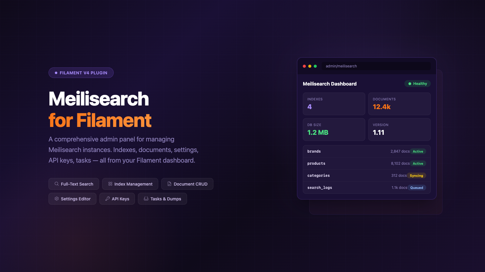

<p align="center">
  
</p>

# Filament Meilisearch Plugin

A comprehensive Filament plugin for managing Meilisearch instances directly from your Filament admin panel. Inspired by [meiliweb](https://github.com/bpolaszek/meiliweb).

## Features

- **Dashboard** - Overview of your Meilisearch instance health, version, and statistics
- **Indexes Management** - Create, view, and delete indexes
- **Documents Management** - Add, search, view, and delete documents
- **API Keys Management** - Create and manage Meilisearch API keys with granular permissions
- **Tasks Monitoring** - View and manage background tasks
- **Dumps** - Create database dumps for backup
- **Snapshots** - Create point-in-time snapshots
- **Index Settings** - View and manage index configuration

## Requirements

- PHP 8.1+
- Laravel 9.0+ | 10.0+ | 11.0+
- Filament v3.0+
- Meilisearch PHP SDK ^1.6

## Installation

```bash
composer require lancodev/filament-meilisearch
```

Publish the configuration file:

```bash
php artisan vendor:publish --tag="filament-meilisearch-config"
```

## Configuration

Add your Meilisearch connection details to your `.env` file:

```env
MEILISEARCH_HOST=http://localhost:7700
MEILISEARCH_KEY=your-master-key
```

Or publish and edit the config file at `config/filament-meilisearch.php`:

```php
return [
    'host' => env('MEILISEARCH_HOST', 'http://localhost:7700'),
    'key' => env('MEILISEARCH_KEY', null),
    
    'navigation' => [
        'group' => 'Meilisearch',
        'icon' => 'heroicon-o-magnifying-glass',
        'sort' => 0,
    ],
    
    'features' => [
        'indexes' => true,
        'documents' => true,
        'keys' => true,
        'tasks' => true,
        'dumps' => true,
        'snapshots' => true,
        'settings' => true,
    ],
];
```

## Usage

### Register the Plugin

In your Filament panel provider (typically `app/Providers/Filament/AdminPanelProvider.php`):

```php
use Lancodev\FilamentMeilisearch\MeilisearchPlugin;

public function panel(Panel $panel): Panel
{
    return $panel
        // ...
        ->plugins([
            MeilisearchPlugin::make()
                ->navigationGroup('Search')
                ->navigationIcon('heroicon-o-magnifying-glass')
                ->navigationSort(10)
                ->features([
                    'indexes' => true,
                    'documents' => true,
                    'keys' => true,
                    'tasks' => true,
                    'dumps' => true,
                    'snapshots' => true,
                    'settings' => true,
                ]),
        ]);
}
```

### Customizing Features

You can enable or disable specific features:

```php
MeilisearchPlugin::make()
    ->features([
        'indexes' => true,
        'documents' => true,
        'keys' => false,      // Disable API keys management
        'tasks' => true,
        'dumps' => false,     // Disable dumps
        'snapshots' => false, // Disable snapshots
        'settings' => true,
    ])
```

## Security

**Important:** Ensure your Meilisearch instance is properly secured. This plugin requires a Meilisearch API key with appropriate permissions. We recommend:

- Using environment variables for sensitive configuration
- Restricting access to the Meilisearch admin panel to authorized users only
- Using Meilisearch's built-in API key management for granular permissions
- Never committing API keys to version control

## License

MIT License. See [LICENSE](LICENSE.md) for details.

## Credits

Inspired by [meiliweb](https://github.com/bpolaszek/meiliweb) by Benoît Polaszek.
